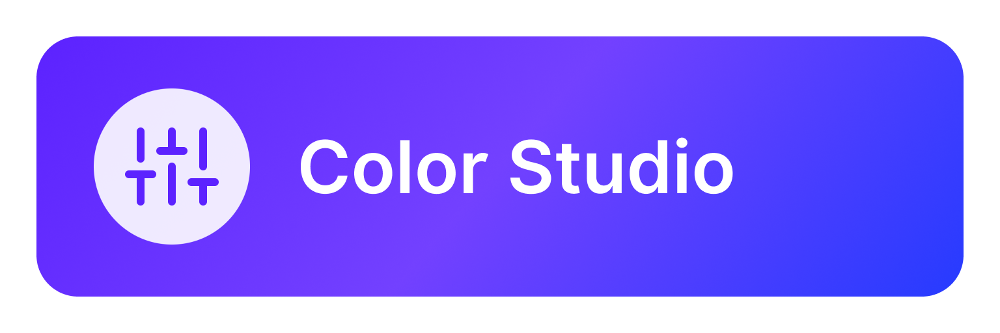
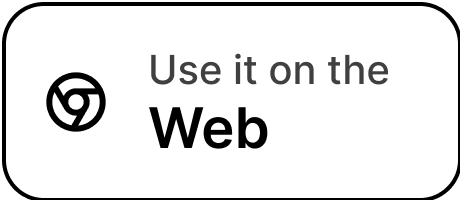
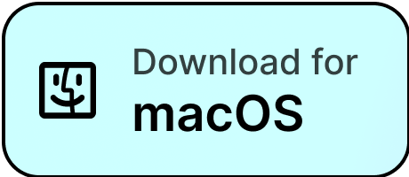

# Color Studio

It is hard to choose colors. Most color pickers give you 16 million colors and ask you to pick one. So many options, in
fact, that your creativity may get blocked. There is no intuitive way to know which colors will fit your needs. This
gets even harder when you deal with multiple colors. Even harder when you want these colors to follow a design
specification and form a coherent theme. This project aims to help solve these problems.

 

| Main | Single Selector |
|:-:|:-:|
|  |  |

### History

First and foremost, but not exclusively, this app follows Material Design, with a special emphasis in dark mode. While
dark mode is trending nowadays, the idea came when
writing [Change Detection](https://github.com/bernaferrari/ChangeDetection). Back then it was hard to make a coherent
dark theme. In [May 2019](https://github.com/material-components/material-components-android/releases/tag/1.1.0-alpha06)
, Material Design Components for Android started receiving dark mode support. Material Dark Theme,
however, [has a twist](https://material.io/design/color/dark-theme.html#properties): it applies a white overlay as a
surface gets higher (more elevated). Back then, as far as I remember, this was mandatory (now it is optional) and
instantly broke half my app. I started using more and more `elevation = 0`, but then it made the light theme worse.
Choosing colors, which was already hard, became trial and error. I relied a lot
on [Color Hexa](https://www.colorhexa.com/), but as my projects got more complex, it got insufficient and became a pain.
Suddenly, I was already developing my own tool.

### Overview

#### Color Scheme

This app allows you to play with 3 colors: Primary, Background and Surface. Background and Surface allows you to
toggle "auto" mode. In auto mode, Background follows
the [Material Design recommendation](https://material.io/design/color/dark-theme.html#properties): 8% of Primary color +
#121212. Regarding Surface color, there is no official recommendation. Initially, the app made it the same as the
Background color, but this didn't feel good. Inspired
by [Moleskine Timepage](https://apps.apple.com/us/app/timepage/id989178902), Surface now gets the Background and adds 5%
of lightness in [HSLuv](http://www.hsluv.org/) color space. If Background has 10% of lightness, Surface has 15%.

Everything was written with extensibility in mind. The colors are not hard-coded, and it is straight-forward to add more
or modify them in the future. In a previous app version, Secondary color was also present, but was removed to make the
app simpler.

#### Contrast

Web Content Accessibility Guidelines (WCAG) recommends a contrast of:

- **3.0:1** minimum for texts larger than 18pt or icons (AA+).
- **4.5:1** minimum for texts smaller than 18pt (AA).
- **7.0:1** minimum when possible, if possible (AAA).

If you want to know more about contrast, read [this](https://usecontrast.com/guide)
, [this](https://www.w3.org/TR/WCAG21/#contrast-minimum)
or [this](https://www.carbondesignsystem.com/guidelines/accessibility/color/).

#### Color Blindness

> Don’t rely on color alone to convey meaning. This includes conveying information, indicating an action, prompting the user for a response, or distinguishing one visual element from another.
>
> Source: [Carbon Design System](https://www.carbondesignsystem.com/guidelines/accessibility/color/)

> Because colorblindness takes different forms (including red-green, blue-yellow, and monochromatic), multiple visual cues help communicate important states. Elements such as strokes, indicators, patterns, texture, or text can describe actions and content.
>
> Source: [Material Design System](https://material.io/design/usability/accessibility.html#color-contrast)

This project allows you to select between 8 different Color Blindness scenarios using the formulas from a Swift library
named [Colorblinds](https://github.com/jdekock/Colorblinds). It automatically updates the contrast ratio between colors,
so that you can see simulate a color blind scenario.

## Reporting Issues

It is not easy to develop alone. I am a developer, not a designer. If you have any design suggestions, feature requests
or would like to integrate your own color specs, issues and pull requests are welcome. You can
report [here](https://github.com/bernaferrari/color-studio/issues).

## License

    Copyright 2021 Bernardo Ferrari

    Permission is hereby granted, free of charge, to any person obtaining a copy of this software and associated documentation files (the "Software"), to deal in the Software without restriction, including without limitation the rights to use, copy, modify, merge, publish, distribute, sublicense, and/or sell copies of the Software, and to permit persons to whom the Software is furnished to do so, subject to the following conditions:

    The above copyright notice and this permission notice shall be included in all copies or substantial portions of the Software.

    THE SOFTWARE IS PROVIDED "AS IS", WITHOUT WARRANTY OF ANY KIND, EXPRESS OR IMPLIED, INCLUDING BUT NOT LIMITED TO THE WARRANTIES OF MERCHANTABILITY, FITNESS FOR A PARTICULAR PURPOSE AND NONINFRINGEMENT. IN NO EVENT SHALL THE AUTHORS OR COPYRIGHT HOLDERS BE LIABLE FOR ANY CLAIM, DAMAGES OR OTHER LIABILITY, WHETHER IN AN ACTION OF CONTRACT, TORT OR OTHERWISE, ARISING FROM, OUT OF OR IN CONNECTION WITH THE SOFTWARE OR THE USE OR OTHER DEALINGS IN THE SOFTWARE.
